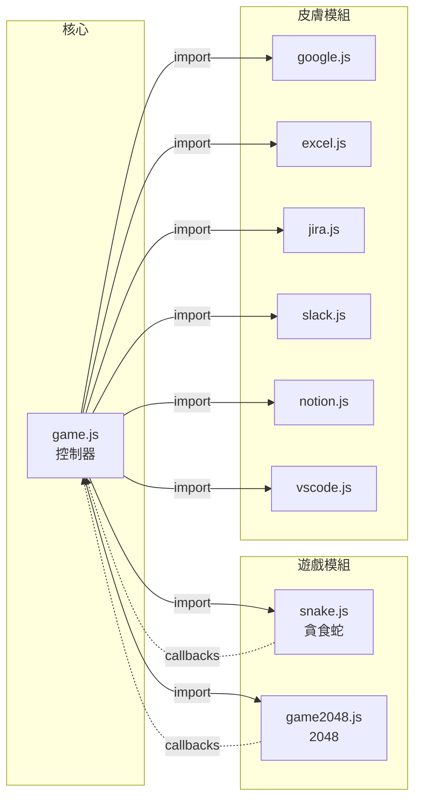
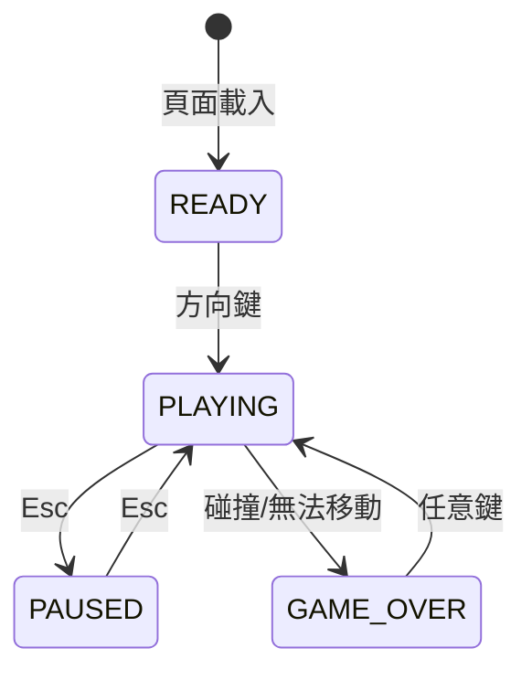

# Operation Cobra 披著工作外皮的隱形遊戲

[](https://opensource.org/licenses/MIT)
[](https://developer.mozilla.org/en-US/docs/Web/JavaScript)
[](https://developer.mozilla.org/en-US/docs/Web/API/Canvas_API)

[← 回到 Muripo HQ](https://tznthou.github.io/muripo-hq/) | [English](README_EN.md)

一款專為上班族設計的「隱形」小遊戲。外觀是工作介面，內裏藏著經典遊戲（貪食蛇 + 2048）。按 Esc 可瞬間暫停並隱藏遊戲，完美應對老闆突襲。

> **"看起來像在工作，其實在摸魚。"**

---

## 核心概念

這是一款**披著工作外皮的遊戲**。

六套偽裝皮膚，六種不同的「正在工作」假象：Google 搜尋、Excel 報表、Jira 看板、Slack 聊天、Notion 文件、VS Code 編輯器。右下角的小 widget 裡藏著遊戲（貪食蛇或 2048），按 Esc 立即變成時鐘——老闆來了也不怕。

你玩的不是遊戲，是**壓力的出口**。

---

## 兩款遊戲

| 遊戲 | 操作 | 特色 | 摸魚安全度 |
|------|------|------|-----------|
| **貪食蛇** | 方向鍵控制 | 經典街機遊戲 | ⭐⭐⭐ |
| **2048** | 方向鍵滑動 | 思考型益智遊戲，無時間壓力 | ⭐⭐⭐⭐⭐ |

> **切換方式**：`Shift+G` 循環切換 / URL 參數 `?game=2048`

---

## 六套偽裝皮膚

| 按鍵 | 皮膚 | 分頁標題 | 適用情境 |
|------|------|----------|----------|
| **1** | Google 搜尋 | 2025 AI 趨勢 - Google 搜尋 | 假裝在研究資料 |
| **2** | Excel 報表 | 2025_Q4_財務報表.xlsx - Excel | 假裝在做財務分析 |
| **3** | Jira 看板 | AI-2025 Sprint 12 \| Jira | 假裝在追 ticket |
| **4** | Slack 聊天 | #general \| AI 開發團隊 \| Slack | 假裝在團隊溝通 |
| **5** | Notion 文件 | 2025 專案規劃 - Notion | 假裝在寫規劃文件 |
| **6** | VS Code | api.ts - ai-project - Visual Studio Code | 假裝在寫程式 |

---

## 功能特色

| 功能 | 說明 |
|------|------|
| **偽裝介面** | 仿真度極高的工作畫面 |
| **一鍵隱藏** | Esc 暫停 + 變成時鐘 widget |
| **皮膚切換** | 1-6 快速切換偽裝 |
| **完全靜音** | 無聲音，不會引起注意 |
| **零安裝** | 純前端，開網頁就能玩 |
| **防露餡** | 禁用 overscroll bounce，滾動不會露出背景 |

---

## 技術棧

| 技術 | 用途 | 備註 |
|------|------|------|
| HTML5 | 結構 | 語意化標籤 |
| CSS3 | 樣式 | 六套皮膚獨立樣式 |
| Vanilla JS | 邏輯 | 無框架依賴 |
| Canvas API | 遊戲繪製 | 貪食蛇渲染 |

---

## 系統架構

### 模組關係



### 遊戲狀態機



---

## 專案結構

```
day-31-operation-cobra/
├── index.html          # 頁面結構（遊戲 widget）
├── style.css           # 所有樣式（六套皮膚）
├── game.js             # 核心控制器（遊戲 + 皮膚切換）
├── games/              # 遊戲模組
│   ├── snake.js        # 貪食蛇遊戲
│   └── game2048.js     # 2048 遊戲
├── skins/              # 皮膚模組
│   ├── google.js       # Google 搜尋皮膚
│   ├── excel.js        # Excel 報表皮膚
│   ├── jira.js         # Jira 看板皮膚
│   ├── slack.js        # Slack 聊天皮膚
│   ├── notion.js       # Notion 文件皮膚
│   └── vscode.js       # VS Code 編輯器皮膚
├── PRD.md              # 產品需求文件
├── SPEC.md             # 系統規格文件
└── README.md
```

---

## 本地開發

```bash
# 複製專案
git clone https://github.com/tznthou/day-31-operation-cobra.git
cd day-31-operation-cobra

# 方法 1：直接開啟
open index.html

# 方法 2：使用 Live Server（推薦）
# VS Code 安裝 Live Server 擴充套件後，右鍵 → Open with Live Server
```

---

## 操作說明

| 按鍵 | 功能 |
|------|------|
| **↑ ↓ ← →** | 控制遊戲（按下即開始） |
| **Esc** | 暫停 + 隱藏遊戲（變成時鐘） |
| **再按 Esc** | 恢復遊戲 |
| **Shift+G** | 切換遊戲（貪食蛇 ↔ 2048） |
| **1-6** | 切換偽裝皮膚 |
| **任意鍵** | Game Over 後重新開始 |

---

## 隨想

### 給老闆的免責聲明

> 老闆，我在上班時都乖乖認真工作喔。這只是下班後練習開發專案、精進程式能力的作品喔。千萬不要因為這樣就把我 FIRE，我真的很認真在上班的！🙏

### 為什麼叫「行動代號眼鏡蛇」？

眼鏡蛇是貪食蛇遊戲中最標誌性的形象。而「行動代號」暗示著這是一場秘密任務——在老闆眼皮底下偷偷摸魚。

### 摸魚的正當性

日本有個詞叫「サボる」（源自法文 sabotage），形容在工作中偷懶。但偷懶不一定是壞事——適度的休息能提升效率，強迫自己長時間專注反而會降低產出。

這個遊戲的存在，是對「工作至上」文化的溫和抗議。

### 為什麼選這六個皮膚？

- **Google**：搜尋是最無辜的行為，誰不需要查資料？
- **Excel**：財務報表看起來最「專業」，沒人敢打擾你
- **Jira**：敏捷開發團隊的標配，看 ticket 是正經工作
- **Slack**：團隊溝通是必要的，誰說這不是工作？
- **Notion**：寫文件是正經事，規劃專案更是理所當然
- **VS Code**：最終極的偽裝——假裝在寫程式，誰敢說你在摸魚？

這六個場景覆蓋了幾乎所有辦公室的「安全區」。

---

## 更新日誌

### v1.1.0 (2025-12-29)

**Bug 修復**
- 🐛 修復貪食蛇快速連按方向鍵可能導致 180° 反轉自殺的問題
- 🐛 修復時鐘計時器在遊戲進行中仍在背景執行的資源浪費
- 🐛 修復 Game Over 後按鍵盤無法重新開始的問題

**程式碼品質改進**
- ✨ 2048 新增快速按鍵保護，防止連擊累積
- ✨ 2048 支援 4096 以上方塊的動態漸變色（金→紅）
- 🔒 移除 `onclick="return false"` 反模式，改用語義化 `<span>`（CSP 友善）
- 🛡️ 新增全域錯誤處理器，遊戲異常時顯示友善提示
- 🛡️ 新增皮膚載入輸入驗證，防止無效皮膚導致錯誤

---

## 未來擴展

- [x] ~~更多皮膚（Slack、Notion、VS Code）~~ ✓ 已完成
- [x] ~~2048 遊戲~~ ✓ 已完成（思考型遊戲，摸魚安全度更高）
- [ ] 最高分紀錄（localStorage）
- [ ] 難度選擇（速度調整）
- [ ] 穿牆模式（蛇可以從邊界穿過）

---

## 授權

MIT License © 2025

---

## 作者

子超 - [tznthou@gmail.com](mailto:tznthou@gmail.com)

---

## 相關連結

- [Muripo HQ](https://tznthou.github.io/muripo-hq/) - 30 天挑戰總部

---

> **"最好的偽裝，是讓人根本不會起疑。"**
