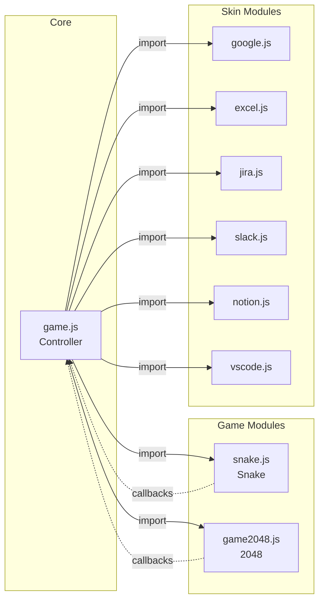
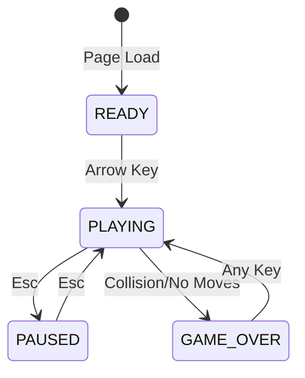

# Operation Cobra

[](https://opensource.org/licenses/MIT)
[](https://developer.mozilla.org/en-US/docs/Web/JavaScript)
[](https://developer.mozilla.org/en-US/docs/Web/API/Canvas_API)

[← Back to Muripo HQ](https://tznthou.github.io/muripo-hq/) | [中文](README.md)

A stealth game designed for office workers. The interface looks like a work application, but hides classic games inside (Snake + 2048). Press Esc to instantly pause and disguise the game — perfect for when the boss walks by.

> **"Looks like work, feels like play."**

---

## Core Concept

This is a game **dressed in work clothes**.

Six disguise skins, six different "I'm working" illusions: Google search, Excel spreadsheet, Jira board, Slack chat, Notion docs, VS Code editor. Games (Snake or 2048) hide in a small widget at the bottom-right corner. Press Esc and it transforms into a clock — boss-proof.

You're not playing a game, you're finding **an escape valve for stress**.

---

## Two Games

| Game | Controls | Features | Slacking Safety |
|------|----------|----------|-----------------|
| **Snake** | Arrow keys | Classic arcade game | ⭐⭐⭐ |
| **2048** | Arrow keys slide | Puzzle game, no time pressure | ⭐⭐⭐⭐⭐ |

> **Switch games**: `Shift+G` to cycle / URL parameter `?game=2048`

---

## Six Disguise Skins

| Key | Skin | Tab Title | Use Case |
|-----|------|-----------|----------|
| **1** | Google Search | 2025 AI 趨勢 - Google 搜尋 | Pretend you're researching |
| **2** | Excel Spreadsheet | 2025_Q4_財務報表.xlsx - Excel | Pretend you're doing financial analysis |
| **3** | Jira Board | AI-2025 Sprint 12 \| Jira | Pretend you're tracking tickets |
| **4** | Slack Chat | #general \| AI 開發團隊 \| Slack | Pretend you're in team communication |
| **5** | Notion Docs | 2025 專案規劃 - Notion | Pretend you're writing documentation |
| **6** | VS Code | api.ts - ai-project - Visual Studio Code | Pretend you're coding |

---

## Features

| Feature | Description |
|---------|-------------|
| **Disguise Interface** | Highly realistic work screens |
| **One-Key Hide** | Esc to pause + transform into clock widget |
| **Skin Switching** | 1-6 to quickly switch disguises |
| **Completely Silent** | No sound, won't attract attention |
| **Zero Installation** | Pure frontend, just open and play |
| **Anti-Exposure** | Disabled overscroll bounce to prevent background from showing |

---

## Tech Stack

| Technology | Purpose | Notes |
|------------|---------|-------|
| HTML5 | Structure | Semantic markup |
| CSS3 | Styling | Six separate skin styles |
| Vanilla JS | Logic | No framework dependencies |
| Canvas API | Game Rendering | Snake game graphics |

---

## System Architecture

### Module Relations



### Game State Machine



---

## Project Structure

```
day-31-operation-cobra/
├── index.html          # Page structure (game widget)
├── style.css           # All styles (6 skins)
├── game.js             # Core controller (game + skin switching)
├── games/              # Game modules
│   ├── snake.js        # Snake game
│   └── game2048.js     # 2048 game
├── skins/              # Skin modules
│   ├── google.js       # Google Search skin
│   ├── excel.js        # Excel Spreadsheet skin
│   ├── jira.js         # Jira Board skin
│   ├── slack.js        # Slack Chat skin
│   ├── notion.js       # Notion Docs skin
│   └── vscode.js       # VS Code Editor skin
├── PRD.md              # Product requirements document
├── SPEC.md             # System specification document
├── README.md           # Chinese documentation
└── README_EN.md        # English documentation
```

---

## Local Development

```bash
# Clone the project
git clone https://github.com/tznthou/day-31-operation-cobra.git
cd day-31-operation-cobra

# Method 1: Direct open
open index.html

# Method 2: Use Live Server (recommended)
# Install Live Server extension in VS Code, then right-click → Open with Live Server
```

---

## Controls

| Key | Function |
|-----|----------|
| **↑ ↓ ← →** | Control game (starts on press) |
| **Esc** | Pause + hide game (transforms to clock) |
| **Esc again** | Resume game |
| **Shift+G** | Switch game (Snake ↔ 2048) |
| **1-6** | Switch disguise skin |
| **Any key** | Restart after Game Over |

---

## Reflections

### Disclaimer for My Boss

> Dear Boss, I work diligently during office hours, I promise! This is just a side project I built after work to practice coding and improve my skills. Please don't fire me because of this — I'm really serious about my job! 🙏

### Why "Operation Cobra"?

The cobra is the most iconic image in Snake games. And "Operation" suggests this is a covert mission — secretly slacking off right under the boss's nose.

### The Case for Slacking

The Japanese have a word "サボる" (saboru, derived from French "sabotage"), meaning to slack off at work. But slacking isn't necessarily bad — moderate rest can improve efficiency, while forcing yourself to focus for long periods actually reduces output.

This game exists as a gentle protest against "work-above-all" culture.

### Why These Six Skins?

- **Google**: Searching is the most innocent activity — who doesn't need to look things up?
- **Excel**: Spreadsheets look the most "professional" — no one dares disturb you
- **Jira**: Standard equipment for agile teams — checking tickets is legitimate work
- **Slack**: Team communication is essential — who says this isn't work?
- **Notion**: Writing docs is serious business — planning projects is totally legitimate
- **VS Code**: The ultimate disguise — pretending to code, who dares say you're slacking?

These six scenarios cover almost all office "safe zones."

---

## Changelog

### v1.1.0 (2025-12-29)

**Bug Fixes**
- 🐛 Fixed Snake rapid arrow key presses causing 180° reverse suicide
- 🐛 Fixed clock timer running in background during active gameplay (resource waste)
- 🐛 Fixed keyboard not working to restart after Game Over

**Code Quality Improvements**
- ✨ 2048 now has rapid key press protection to prevent input stacking
- ✨ 2048 supports dynamic gradient colors for tiles > 4096 (gold → red)
- 🔒 Removed `onclick="return false"` anti-pattern, replaced with semantic `<span>` (CSP friendly)
- 🛡️ Added global error handler with user-friendly message on game errors
- 🛡️ Added skin loading input validation to prevent invalid skin errors

---

## Future Enhancements

- [x] ~~More skins (Slack, Notion, VS Code)~~ ✓ Completed
- [x] ~~2048 game~~ ✓ Completed (puzzle game, higher slacking safety)
- [ ] High score tracking (localStorage)
- [ ] Difficulty selection (speed adjustment)
- [ ] Wall-pass mode (snake can pass through borders)

---

## License

MIT License © 2025

---

## Links

- [Muripo HQ](https://tznthou.github.io/muripo-hq/) - 30-Day Challenge Headquarters

---

> **"The best disguise is one that raises no suspicion at all."**
