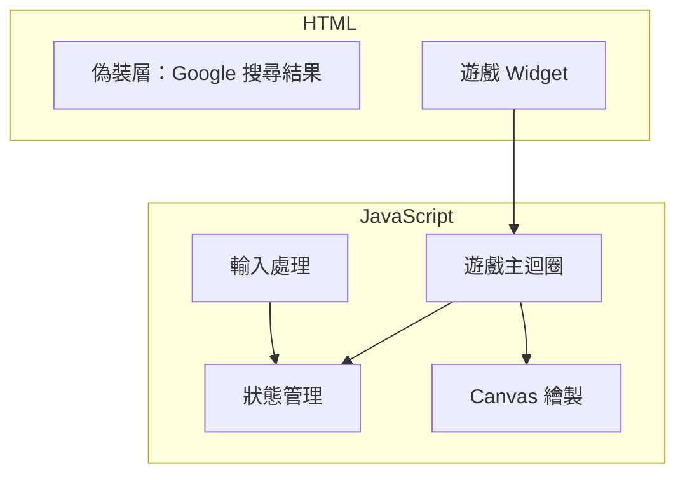
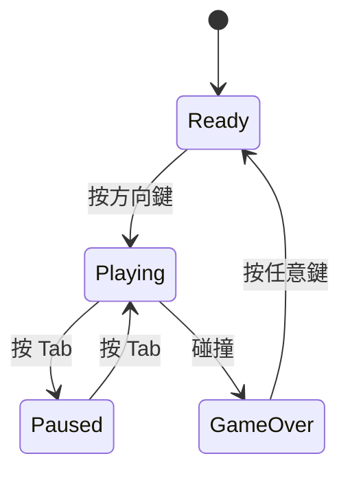

# 📘 SPEC - Operation Cobra

> 系統規格文件：遊戲邏輯、狀態管理與 UI 結構

---

## 🧩 一、目的

定義貪食蛇遊戲的技術實作細節，包含：
1. 頁面結構與偽裝設計
2. 遊戲狀態機
3. 核心演算法
4. 事件處理

---

## 🏗️ 二、系統架構



---

## 🧱 三、模組與責任劃分

| 模組 | 功能說明 | 輸入 | 輸出 |
|------|----------|------|------|
| Disguise UI | 偽裝的 Google 搜尋頁面 | - | DOM 結構 |
| Game Widget | 右下角遊戲容器 | - | Canvas 元素 |
| Game State | 管理蛇、食物、分數、狀態 | 使用者輸入 | 狀態物件 |
| Game Loop | 每幀更新邏輯 | 狀態 | 繪製指令 |
| Input Handler | 監聽鍵盤事件 | KeyboardEvent | 方向 / 暫停指令 |
| Renderer | Canvas 繪製 | 狀態 | 視覺輸出 |

---

## ⚙️ 四、頁面結構

```html
<body>
  <!-- 偽裝層 -->
  <div class="google-disguise">
    <div class="search-bar">...</div>
    <div class="search-results">
      <!-- 假的搜尋結果 -->
    </div>
  </div>
  
  <!-- 遊戲層 -->
  <div id="game-widget" class="widget">
    <canvas id="snake-canvas"></canvas>
    <div class="score">Score: 0</div>
  </div>
</body>
```

### Widget 樣式規格

| 屬性 | 值 | 說明 |
|------|-----|------|
| 位置 | `position: fixed; right: 20px; bottom: 20px` | 右下角固定 |
| 尺寸 | `200px × 200px` | 小巧不顯眼 |
| 隱藏態 | `opacity: 0.3; pointer-events: none` | 變淡 + 無法互動 |
| 邊框 | `1px solid #ddd; border-radius: 8px` | 看起來像廣告 widget |

---

## 🎮 五、遊戲狀態機



### 狀態定義

```javascript
const GameState = {
  READY: 'ready',      // 等待開始
  PLAYING: 'playing',  // 遊戲中
  PAUSED: 'paused',    // 暫停（隱藏中）
  GAME_OVER: 'over'    // 遊戲結束
}
```

---

## 🐍 六、遊戲邏輯規格

### 6.1 網格系統

| 參數 | 值 |
|------|-----|
| Canvas 尺寸 | 200 × 200 px |
| 格子大小 | 10 × 10 px |
| 網格數量 | 20 × 20 格 |

### 6.2 蛇的資料結構

```javascript
const snake = {
  body: [{x: 10, y: 10}, {x: 9, y: 10}, {x: 8, y: 10}], // 頭在前
  direction: 'right',  // 當前方向
  nextDirection: 'right' // 下一幀方向（防止 180 度轉向）
}
```

### 6.3 移動邏輯

```
每幀執行：
1. 根據 nextDirection 計算新頭部位置
2. 新頭部加入 body 最前面
3. 如果沒吃到食物 → 移除尾巴
4. 如果吃到食物 → 保留尾巴（蛇變長）+ 生成新食物 + 加分
```

### 6.4 碰撞檢測

```javascript
function checkCollision(head) {
  // 撞牆
  if (head.x < 0 || head.x >= 20 || head.y < 0 || head.y >= 20) {
    return true
  }
  // 撞自己（檢查頭是否與身體任一節重疊）
  for (let i = 1; i < snake.body.length; i++) {
    if (head.x === snake.body[i].x && head.y === snake.body[i].y) {
      return true
    }
  }
  return false
}
```

### 6.5 食物生成

```javascript
function spawnFood() {
  let position
  do {
    position = {
      x: Math.floor(Math.random() * 20),
      y: Math.floor(Math.random() * 20)
    }
  } while (isOnSnake(position)) // 確保不在蛇身上
  return position
}
```

---

## ⌨️ 七、輸入處理

| 按鍵 | 動作 | 條件 |
|------|------|------|
| ↑ | direction = 'up' | 當前非 'down' |
| ↓ | direction = 'down' | 當前非 'up' |
| ← | direction = 'left' | 當前非 'right' |
| → | direction = 'right' | 當前非 'left' |
| Tab | 切換 PLAYING ↔ PAUSED | 遊戲中或暫停中 |
| 任意鍵 | 重新開始 | GAME_OVER 狀態 |

### 防止 180 度轉向

```javascript
function setDirection(newDir) {
  const opposites = { up: 'down', down: 'up', left: 'right', right: 'left' }
  if (newDir !== opposites[snake.direction]) {
    snake.nextDirection = newDir
  }
}
```

---

## 🎨 八、繪製規格

| 元素 | 顏色 | 說明 |
|------|------|------|
| 背景 | `#f0f0f0` | 淺灰，融入頁面 |
| 蛇頭 | `#2d5a27` | 深綠 |
| 蛇身 | `#4a8b3c` | 綠色 |
| 食物 | `#c0392b` | 紅色小點 |
| 分數 | `#666` | 灰色小字 |

---

## ⏱️ 九、遊戲速度

| 參數 | 值 |
|------|-----|
| 更新頻率 | 150ms / 幀 |
| 換算 | 約 6.67 FPS |

速度選擇理由：不太快（玩家能反應）、不太慢（有緊張感）

---

## 🧪 十、測試案例

| 測試項目 | 步驟 | 預期結果 |
|----------|------|----------|
| 基本移動 | 按右鍵 | 蛇往右移動 |
| 吃食物 | 蛇頭碰到食物 | 蛇變長、分數 +10、新食物出現 |
| 撞牆 | 蛇頭超出邊界 | Game Over |
| 撞自己 | 蛇頭碰到身體 | Game Over |
| Tab 暫停 | 遊戲中按 Tab | 遊戲暫停、widget 變淡 |
| Tab 恢復 | 暫停中按 Tab | 遊戲繼續、widget 恢復 |
| 防反向 | 往右時按左 | 方向不變（忽略指令） |

---

## 📚 十一、相關文件

- [`README.md`](./README.md) — 專案說明
- [`PRD.md`](./PRD.md) — 產品需求
